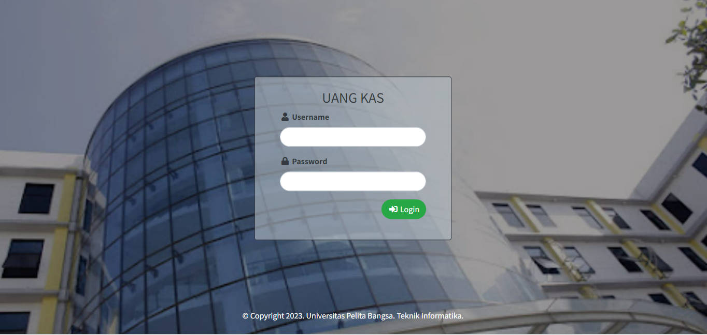

### Proyek UAS Pemrograman Web Semester 3
Nama : Abdus Shomad
---
NIM : 312110089
---
Kelas : TI.21.B1
---

Membuat Aplikasi Sederhana dengan ketentuan: 
• Dibuat menggunakan PHP dan MySQL 
• Desain database dan alur sistem sudah disediakan 
• Desain tampilan responsive (mobile first) ➔ silakan gunakan 
Framework CSS (Twitter Bootstrap atau yg lain)
Mahasiswa dengan NIM Ganjil Membuat Aplikasi Pengelolaan Iuran KAS RT

Berikut hasil screenshotnya
**Login**

**Dasboard**

**Menu Warga**

**Menu bulan Iuran**

**Data Iuran Warga**

**Menu pengeluaran**

LINK YouTube : [YourLink](https://youtu.be/buTpzDRXQKA)
---
Link Demo Aplikasi : [YourLink](http://uasmadso.byethost7.com/kas)
---
Username : Dosen01
Password : 123456
---

Terimakasih !!!